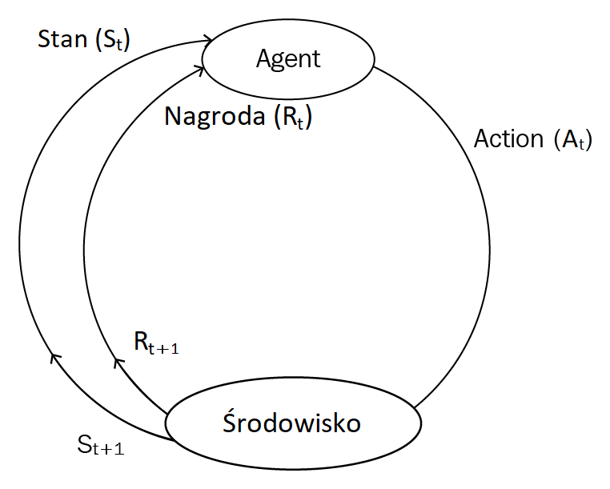

# Table of Contents

1.  [Wstęp do RL](#org36cf86e)

# Wstęp do RL

1.  Czym jest RL?
    -   Załóżmy, że uczysz psa łapać piłkę, ale nie mówisz mu dokładnie, że ma złapać piłkę.
        Po prostu rzucasz piłką i za każdym razem jak pies złapie piłkę, dajemy mu ciastko, jeżeli nie złapie, to nie dostanie.
        Pies po pewnym czasie nauczy się, jaka akcja doprowadzi do dostania ciastka, a jaka nie.
        
        W środowisku RL nie uczymy agenta co ma robić i jak, tylko dajemy pozytywną, nagrodę gdy uda mu się zrobić to co chcemy.
        A zatem, jest to proces prób i błędów. Nagroda może być przyznawana co każdy krok, bądź co jakiś etap np. przejście całego poziomu.

2.  RL algorytm
    1.  Agent wykonuje interakcję ze środowiskiem, za pomocą dostępnych akcji,
    2.  po wykonaniu akcje agent przechodzi z jednego stanu w drugi,
    3.  agent otrzymuje nagrodę za wykonaną akcje,
    4.  na postawie otrzymanej nagrody agent rozumie, czy działanie to było dobre, czy złe,
    5.  jeżeli agent otrzymał pozytywną nagrodę, będzie ją powtarzać, albo będzie próbować innych akcji, które również dają pozytywną nagrodę.

3.  Elementy RL
    1.  Agent 
        -   Agenci to inteligentne programy podejmujące decyzję. To ich uczymy w RL.
            Agent wykonuje akcję przez interakcje ze środowiskiem, otrzymują nagrodę opartą na wykonanej akcji.
            Przykładem agenta jest Super Mario poruszający się w grze.
    
    2.  Funkcja polityki (Policy function)
        -   Polityka agenta decyduje o tym, jak agent będzie się zachowywał w środowisku, politykę oznaczamy, jako π.
            Chcąc dotrzeć do biura z domu, możesz wybrać różne ścieżki, jedne będą krótsze inne dłuższe. Te ścieżki nazywany polityką (strategią), 
            ponieważ reprezentują one różne sposoby do wykonania zadania. My decydujemy którą ścieżkę wybierzemy.
    
    3.  Funkcja wartości (Value function)
        -   Wartość ta informuje agenta, jak dużą wartość ma dla niego bycie w szczególnym stanie. Jest to zależne od polityki, którą agent się kieruje.
            Funkcje wartości oznacza się jako v(s).
            Jest równa całkowitej oczekiwanej nagrodzie otrzymanej przez agenta, począwszy od stanu początkowego.
            Może istnieć kilka funkcji wartości. 
            Optymalną funkcją wartości jest ta która ma największą wartość dla wszystkich stanów, względem innych funkcji wartości.
            Analogicznie optymalną polityką jest ta, która posiada najlepszą funkcję wartości.
    
    4.  Model
        -   Model jest reprezentacją agenta w środowisku. Nauka może przebiegać na dwa sposoby:
            -   model-based learning
                Agent wykorzystuje wcześniej zdobyte informacje do wykonania zadania.
            -   model-free  learning
                Agent opiera się na doświadczeniu pozyskanemu z prób i błędów (trial-and-error experience), celem wykonania następnej akcji.
        
        -   Zakładając, że chcesz jak najszybciej dotrzeć do biura z domu,
            -   w model-based korzystamy z wcześniej zdobytego doświadczenia (mapy)
            -   w model-free wypróbujesz wszystkich dostępnych tras i wybierzesz najszybszą.

4.  Środowisko agenta - interfejs
    -   Agent wykonuje akcję [A](<http://latex.codecogs.com/png.latex?%5Cpi>) w czasie t, 
        przechodząc ze stanu [St](<http://latex.codecogs.com/png.latex?S_t>) do następnego stanu [St+1](<http://latex.codecogs.com/png.latex?S_%7Bt&plus;1%7D>).
        Poprzez akcje, agent otrzymuję od środowiska liczbową nagrodę R. Ostatecznie celem RL jest znalezienie optymalnych akcji, które zwiększą liczbową nagrodę.
        
        

          
          

5.  Środowisko - rodzaje
    -   Wszystko z czyn agent wchodzi w interakcje, nazywamy środowiskiem.
    
    -   Deterministyczne środowisko (Deterministic environment)
        -   Środowisko jest deterministyczne, kiedy znamy wynik na podstawie obecnego stanu.
            W grze w szachy znamy dokładnie wynik przeniesienia pionka przez dowolnego gracza.
    
    -   Stochastyczne środowisko (Stochastic environment)
        -   Środowisko jest stochastyczne, kiedy nie jesteśmy w stanie przewidzieć wyniku na podstawie obecnego wyniku.
            Najwyższy poziom niepewności. Nigdy nie wiemy jaką liczbę wylosuje nam rzut kością.
    
    -   W pełni obserwowane środowisko (Fully observable environment)
        -   Agent może zawsze określić stan systemu, w grze w szachy stan systemu, czyli pozycja wszystkich graczy na szachownicy,
            jest dostępna przez cały czas, wiec gracz może wykonać optymalny ruch/decyzje.
    
    -   Częsciowo obserwowane środowisko (Partially observable environment)
        -   Agent nie może określić stanu systemu w każdym momencie, w pokerze, 
            nie wiemy nic o kartach naszych rywali.
    
    -   Dyskretne środowisko (Discrete environment)
        -   Agent posiada skończoną ilość akcji, aby przejść z jednego stanu do drugiego.
            W szachach mamy ograniczoną ilość możliwych posunięć.
    
    -   Ciągłe środowisko (Continous environment)
        -   When there is an infinite state of actions available for moving from one state to another, 
            it is called a continuous environment.
            Mamy wiele tras dostępnych do podróży ze źródła do miejsca docelowego.
    
    -   Epizodyczne i nieepizodyczne środowisko (Episodic and non-episodic environmrnt)
        -   W epizodycznym środowisku bieżące działania agenta nie wpływają na przyszłe,
            a w  nieepizodycznym środowisku bieżące akcje wpływają na przyszłe. 
            Nieepizodyczne środowisko jest nazywane również środowiskiem sekwencyjnym.
            
            Epizodyczne - niezależne zadania
            Nieepizodyczne - powiązane zadania
    
    -   Pojedyncze i wielo-agentowe środowisko (Single and multi-agent environment)
        -   W pojedynczym mamy jednego agenta, a w wielo-agentowym wielu.
            Środowiska z wieloma agentami są szeroko wykorzystywane podczas złożonych zadań.

6.  RL - platformy
    1.  OpenAI Gym i Universe
        -   OpenAI Gym jest narzędziem do budowania, szacowania, porównywania różnych algorytmów RL.	  
            Są kompatybilne z algorytmami napisanymi w TemsorFlow, Theano, Keras. Zapewnia interfejs dla wszystkich zadań RL.
            
            OpenAI Universe jest rozszerzeniem do OpenAI Gym. Pozwala na trenowanie i ocenianie agenta w prosty sposób, w złożonym środowisku czasu rzeczywistego.
            Pozwala on na <b>przekształcenie dowolnego programu w środowisko Gym</b> bez dostępu do wewnętrznych elementów programu, kodu źródłowego czy API, 
            dzieje się tak, ponieważ Universe uruchamia program w wirtualnej maszynie.
    
    2.  DeepMind Lab
        -   Platforma dla AI agent-based. Zawiera bogate symulowane środowisko pozwalające na uruchomienie kilku RL algorytmów. Jest wysoce modyfikowalne oraz rozszerzalne.
            Wizualizacje są bardzo wzbogacone, sience fiction-style, i realistyczne.
    
    3.  RL-Glue
        -   Platforma ta pozwana na połączenie agentów, środowisk i programów, nawet jeżeli są napisane w różnych językach programowania. 
            Daje to możliwość dzielenia się z innymi twoimi agentami i środowiskiem.
    
    4.  Project Malmo
        -   Kolejna platforma służąca do eksperymentowania z AI, od Microsoft-u, która jest zbudowana na bazie Minecrafta. Zapewnia dobrą elastyczność w dostosowywaniu środowiska.
            Jest zintegrowany z wyszukanymi środowiskami, pozwana na overclockig, do daje programistą możliwość na szybkie odgrywanie scenariuszy. 
            Malmo aktualnie pozwala na tworzenie tylko Minecraft-owych środowisk, nie jak OpenAI Universe.
    
    5.  ViZDoom
        -   Jak sama nazwa wskazuje, jest to doom-based AI platforma. Zapewnia wsparcie dla wieloagentowego i konkurencyjnego (agenci walczą między sobą) środowiska do testowania agenta.
            Jednakże VizDoom wspiera tylko środowisko w grze Doom. Zapewnia renderowanie off-screen i wsparcie single, multiplayer.

7.  RL - zastosowanie
    -   Dzięki większym postępom i badaniom, RL szybko ewoluowały i są aktualnie stosowane w wielu miejscach, od gier komputerowych po automatyzację samochodu.
    
    -   Nauka
        -   Wiele platform e-learningowych używa RL do personalizowania treści pod każdego studenta. Niektórzy studenci lepiej się uczą z video inni, tworząc projekty itp.
            RL zbierając dane od studentów, i jest w stanie wybrać takie materiały, które pozwolą na przygotowanie treści specjalnie pod danego studenta.
    
    -   Medycyna i opieka zdrowotna
        -   RL personalizuje leczenie pod pacjenta, diagnozuje po obrazach medycznych, tworzy strategię leczenia, wspiera decyzje lekarza, and so on.
    
    -   Produkcja (Manufacturing)
        -   Inteligentne roboty są używane, do rozmieszczania obiektów w odpowiednie miejsca. Jeżeli uda mu się bądź nie, zapamiętują to i próbują poprawić skuteczność.
            Zastosowanie inteligentnych robotów zredukuje koszt pracy i zapewni lepszą wydajność. (Złe roboty, prace chcą nam zabrać!)
    
    -   Zarządzanie zasobami
        -   Zarządzanie dostawami, prognozowanie popytu, efektywne zarządzanie przestrzenią. 
            Badacze z Google DeepMind opracowali algorytm RL, do zmniejszenia zużycia energii w ich serwerowniach.
    
    -   Finanse
        -   Zarządzanie finansami, redystrybucja funduszy od różnych produktów, prognozowanie rynku. JP Morgan użył RL do realizacji dużych zamówień.
    
    -   Przetwarzanie języka naturalnego i Rozpoznawanie obrazów
        -   Przy ujednoliceniu mocy głębokiego uczenia (deep learning) i RL dostajemy Głębokie RL (Deep Reinforcement Learning (DRL)), co daje możliwość 
            popisu w kwestiach przetwarzania języka naturalnego (Natural Language Processing (NLP)) i rozpoznawania obrazu (Computer Vision (CV)).
            DRL jest stosowany do streszczania tekstu, ekstrakcji informacji, tłumaczeniu maszynowym oraz rozpoznawaniu obrazu, zapewniają większą dokładność niż obecne systemy.

